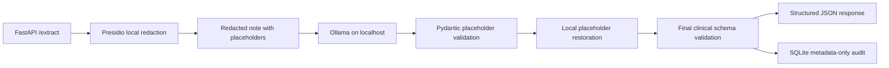

# Offline AI Assistant for Clinical Note Extraction

[](https://github.com/nikithpusarla/Offline-ai-assistant-with-model-bechmark/actions/workflows/ci.yml)

A local-only clinical note extraction system built for privacy-sensitive healthcare workflows. The assistant runs open-source language models through Ollama, redacts synthetic PHI locally with Presidio, validates every response with Pydantic, records metadata-only audit events in SQLite, and benchmarks multiple local models before selecting a production default.

> **Synthetic data only:** This repository contains fictional clinical notes and must never be used with real patient data without a formal security, privacy, and compliance review.

## Why This Project

Healthcare organizations cannot casually send clinical notes to third-party AI APIs. This project demonstrates an alternative deployment pattern in which note text stays on the local machine:

- Ollama is restricted to `localhost`.
- Presidio redacts configured PHI before inference.
- The model receives placeholders instead of detected identifiers.
- Pydantic rejects malformed JSON and hallucinated fields.
- SQLite stores audit metadata only, never notes or original redacted values.
- A benchmark compares accuracy, reliability, speed, retries, and hallucination safety.

## Architecture



## Extracted Fields

The assistant extracts:

- `patient_name`
- `date_of_birth`
- `diagnosis_codes`
- `medications`
- `visit_date`
- `chief_complaint`

Missing fields become `null` or empty lists. The prompt explicitly prohibits inference, and every schema uses `extra="forbid"` to reject unexpected fields.

## Technology Stack

- Python 3.11+
- Ollama and local GGUF models
- Pydantic v2
- Presidio Analyzer and Anonymizer
- FastAPI and Uvicorn
- SQLite
- Pytest
- Rich
- PyYAML

## Project Structure

```text
app/
	main.py          FastAPI /extract and /health endpoints
	schemas.py       Pydantic models and prompt instructions
	llm_client.py    Local Ollama client with JSON retries
	redaction.py     Local Presidio redaction and MRN recognizer
	audit_log.py     Metadata-only SQLite audit trail
benchmark/
	golden_set.json  20 synthetic hand-verified notes
	edge_cases.json 10 missing-field safety cases
	prompts.json     Reproducible synthetic prompt fixtures
	run_benchmark.py Benchmark runner and README table generator
	scorer.py        Weighted model scoring
security_tests/
	test_redaction_adversarial.py
	test_network_isolation.py
	test_hallucination_safety.py
tests/              Unit tests for schemas, redaction, client, and scoring
models_config.yaml  Local endpoint, models, production default, PHI entities
requirements.txt    Python dependencies
```

## Installation

From PowerShell on Windows:

```powershell
Set-Location "C:\Users\nikit\Downloads\offline ai assistant"
py -3.13 -m venv .venv
.\.venv\Scripts\python.exe -m pip install -r requirements.txt
```

Install Ollama from [ollama.com/download](https://ollama.com/download), make sure it is running, and verify the local endpoint:

```powershell
ollama --version
Invoke-RestMethod http://localhost:11434/api/tags
```

Pull the three benchmark models:

```powershell
ollama pull llama3.2:3b
ollama pull qwen2.5:3b-instruct
ollama pull gemma2:2b
```

The tested machine had limited free RAM. `gemma2:2b` is the lightest model; close other applications if running the 3B models causes memory pressure.

## Run the API

Start the local server:

```powershell
.\.venv\Scripts\python.exe -m uvicorn app.main:app --reload
```

Check local health:

```powershell
Invoke-RestMethod http://localhost:8000/health
```

Submit a fictional note:

```powershell
$body = @{
	raw_text = "Patient: Avery Example. DOB: 1980-01-02. Visit: 2026-01-03. Diagnosis: Z00.00. Medication: none."
	document_type = "clinical_note"
} | ConvertTo-Json

Invoke-RestMethod http://localhost:8000/extract -Method Post `
	-ContentType "application/json" -Body $body
```

The production default is configured in `models_config.yaml` and currently points to `qwen2.5:3b-instruct`, the benchmark winner.

## Testing

Run the complete automated suite:

```powershell
.\.venv\Scripts\python.exe -m pytest tests security_tests -q
```

The suite covers strict schemas, retry behavior, adversarial PHI formats, custom MRN redaction, hallucination safety, reproducible prompt contracts, and localhost-only endpoint enforcement.

GitHub Actions runs this same test suite on Python 3.11, 3.12, and 3.13 for pushes and pull requests. The CI job does not run the Ollama benchmark because model inference requires locally installed models and hardware; run that benchmark locally with the command below.

## Benchmarking

Run all three models over the 20-case synthetic golden set:

```powershell
.\.venv\Scripts\python.exe benchmark\run_benchmark.py
```

The benchmark runs 60 model-case combinations and writes raw per-case metrics to `benchmark/results.json`. It also prints a Rich comparison table and regenerates this README section. Composite scoring uses:

- 35% field-level accuracy
- 20% first-try schema validity
- 20% inverted P95 latency
- 15% inverted retry count
- 10% inverted hallucination rate

The scorer applies safety gates before ranking: any detected original PHI value in the raw model response fails the model safety gate, and hallucination above 5% fails the gate. Field accuracy uses field-specific normalization and precision/recall/F1 rather than broad string similarity. Results also include per-field metrics, complete-versus-missing-field category metrics, median and P95 latency, deterministic bootstrap 95% confidence intervals, and paired model comparisons over shared case IDs. Detailed scored output is written to `benchmark/summary.json`.

Because the scorer contract is versioned by the result fields, an older `benchmark/results.json` is automatically refreshed when required safety or per-field metrics are missing.

## Benchmark Results

The table below is the current scorer view of the completed 60-case synthetic run. Higher is better. A hallucination rate above 5% or any detected PHI leakage fails the safety gate and forces the composite score to zero. Run the benchmark again after this scorer upgrade to populate the new per-field, leakage, confidence-interval, and paired-comparison artifacts from fresh model responses.

| Model | Rating | Field accuracy | Median latency | P95 latency | First-try validity | Hallucination rate | PHI leakage | Safety gate | Composite score |
|---|---:|---:|---:|---:|---:|---:|---:|---|---:|
| `qwen2.5:3b-instruct` | **76/100** | 70.2% | 12,794 ms | 35,734 ms | 90.0% | 0.0% | 0.0% | Pass | **76.2%** |
| `gemma2:2b` | **74/100** | 41.7% | 10,102 ms | 23,275 ms | 80.0% | 0.0% | 0.0% | Pass | 74.1% |
| `llama3.2:3b` | **40/100** | 45.5% | 23,004 ms | 48,628 ms | 35.0% | 5.0% | 0.0% | Pass* | 40.3% |

\* The saved legacy rows do not contain raw model responses, so their PHI leakage value defaults to zero. A fresh benchmark run is required for an evidence-backed leakage gate.

### Recommendation

Use `qwen2.5:3b-instruct` as the provisional production default for this synthetic clinical extraction workload. It has the best field accuracy, highest first-try validity, and strongest current composite score. Treat the recommendation as final only after rerunning the benchmark with the upgraded safety fields populated; healthcare deployment should prioritize verified non-invention and zero PHI leakage over raw latency alone.

## Repository Name

The original repository URL contains the typo `bechmark`. The correctly spelled target `Offline-ai-assistant-with-model-benchmark` does not currently exist on GitHub. After renaming the existing repository or creating the corrected one, update the local remote with:

```powershell
git remote set-url origin https://github.com/nikithpusarla/Offline-ai-assistant-with-model-benchmark.git
git push -u origin main
```

## Security and Compliance Notes

Presidio runs before the Ollama request and recognizes PERSON, DATE_TIME, US_SSN, PHONE_NUMBER, MEDICAL_LICENSE, LOCATION, EMAIL_ADDRESS, and a custom MRN pattern. Redaction mappings are used only in local process memory to restore placeholders after model validation.

The audit database records timestamp, redaction entity types/count, model name, retry count, and validation status. It does not record raw notes, model prompts, model responses, or original redacted values. The client rejects non-local Ollama URLs, and `/health` reports that external endpoints are not configured.

For a formal security review, also block outbound traffic with Windows Firewall, run the API and tests, and inspect firewall logs. This project supports a local data-sovereignty architecture but is not a HIPAA certification or legal compliance guarantee. Production use still requires access control, encryption, retention policies, infrastructure hardening, monitoring, and organizational review.
